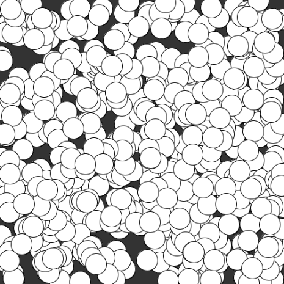
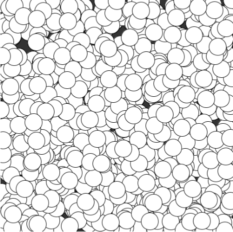
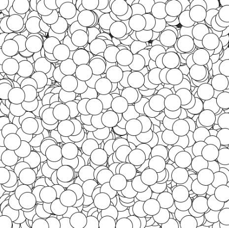
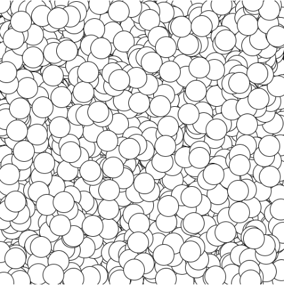
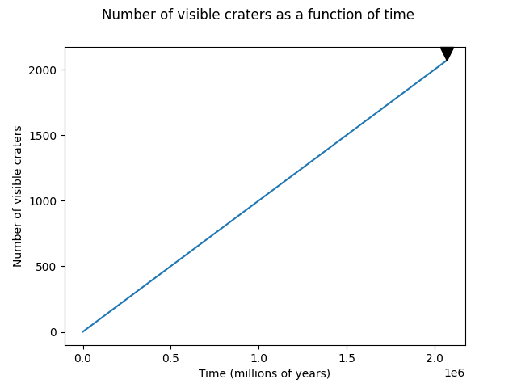

# planet-cratering-simulation

Kyle Heinze

Written in Python, uses Processing API

code available at [github.com/ikjh/planet-cratering-simulation](github.com/ikjh/planet-cratering-simulation)

## Assumptions

The size distribution of the impactors is derived from a power law distribution with alpha = 2.5. This data was generated from the  [powerlaw python library](https://github.com/jeffalstott/powerlaw) which was implemented on the basis of a paper written by Aaron Clauset, a professor at CU Boulder.

Craters are 500 km diameter maximum (see generate_data.py)

Craters are deemed removable (invisible) if their centers are overlapped by a newer, larger crater. 

The simulation terminates according to a threshold called "consecutive underlaps". An underlap occurs when a new crater touches any other crater at all, not just another's center. Consecutive underlaps mean that each new crater fails to hit an empty portion of the surface, implying the surface is becoming saturated or already is. After roughly 2000 consecutive underlaps, the simulation ends. At any point a crater hits an empty area, this value resets.

## Sample Data
25% complete

50% complete

75% complete

Complete

Other data:

On the graph above, the black arrow indicates the estimated saturation point. The jagged edges on this graph are due to the rapid deletion and addition of new craters. If a large crater impacts the surface, many smaller craters tend to be removed. After some time, the amount of visible craters tends to level off around 300-350 craters, which indicates saturation.

## Changed assumptions

instead of using various sized craters modeled from a distribution, my changed assumption was to make every crater the same size, 75 km.

With this configuration, no craters were detected as overlapped by my algorithm, and were thus not deleted from the data. This makes saturation occur much quicker.  Also, my simulation end detector breaks in this configuration.

25% complete

50% complete

75% complete

Complete

Other data:

